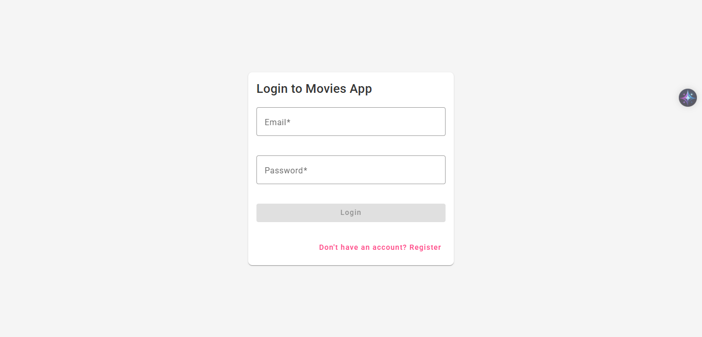
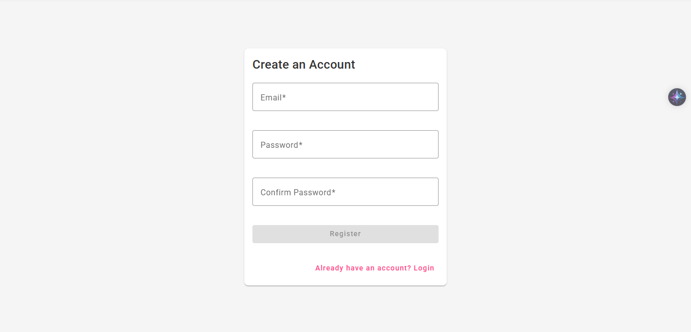
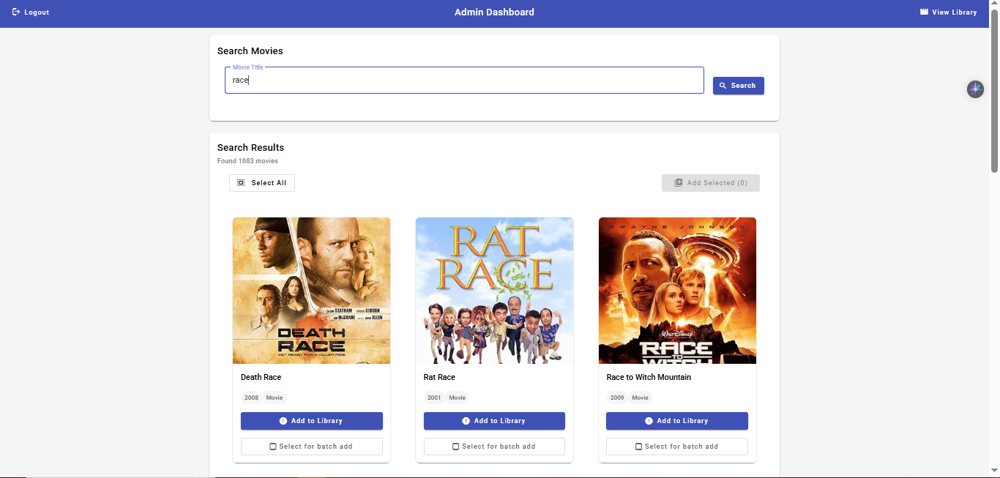
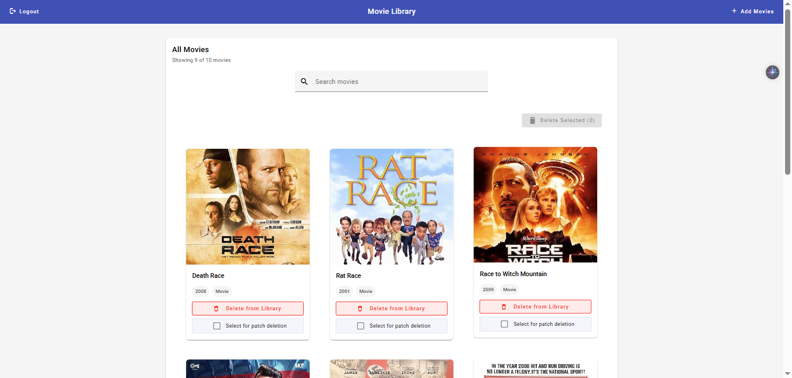
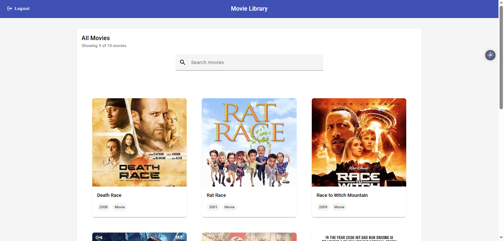
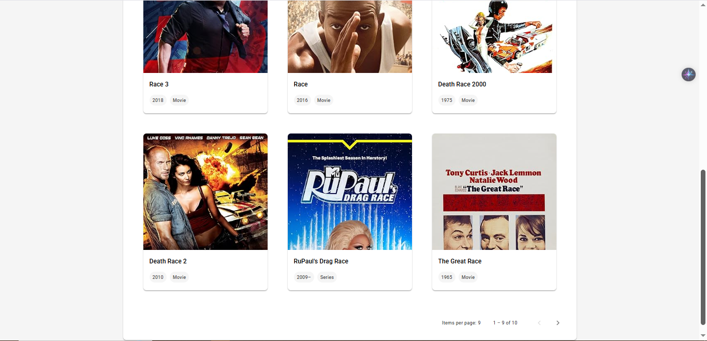
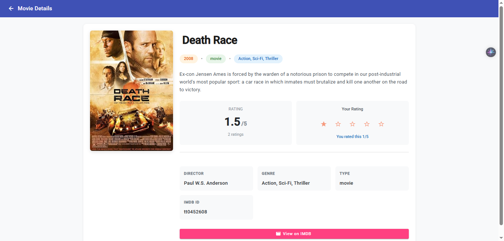

# Movies Library Application

## Features

- **Authentication & Authorization**: Secure user registration and login with JWT-based role-based access control (Admin & User roles).
- **Movies Search**: Admins can search for movies via the OMDB API based on search criteria
- **Library Management** : Admins can delete or add movies to the library (patch or single operation) 
- **Movies liabrary** : Admins And normal users can see the movies list and search for specefic titles
- **Movie Details & Ratings** : Admins And normal users can view detailed information for any movie and submit ratings.
- **Pagination Support** : Pagination for both the OMDB movie search results and the movie library.


## Preview

### Login Page


### Registration Page


### Admin dashboard 


### Admin Movie List  


### User movies list page  


### user movies list pagination 


### movie details 


## Technologies Used

### Backend:
- **Java 17**
- **Spring Boot**
- **MySQL**
- **spring security with jwt**

### Frontend:
- **Angular 16+**

## Setup Instructions


### Running Locally

1. Clone the repository:
   ```sh
   git clone https://github.com/ahmedraslan28/movies-app.git
   cd movies-app
   ```
2. Create the MySQL database 
    ```sh
    Create a database named movieApp in your MySQL server.
    CREATE DATABASE movieApp ;
    ```

3. Set up database configuration in application.properties:
   ```sh
   spring.datasource.url=jdbc:mysql://localhost:3306/movieApp
   spring.datasource.username = your_db_username
   spring.datasource.password=your_db_password
   ```

4. Set up your OMDB api key in application.properties:
   ```sh
   omdb.api.key=YOUR_OMDB_API_KEY
   ```

5. Set up the backend:
   ```sh
   cd movies-app-api
   mvn spring-boot:run
   ```

6. Set up the frontend:
   ```sh
   cd movies-app-client
   npm install
   ng serve
   ```

7. access the app
  * Frontend: http://localhost:4200
  * Backend: http://localhost:8080
  * admin account {email: admin@fawry.com, password: fawry}
  * user account  {email: user@fawry.com, password: fawry}


### Running Using Docker
1. Docker should be installed on your machine:
   
2. Clone the repository:
   ```sh
   git clone https://github.com/ahmedraslan28/movies-app.git
   cd movies-app
   ```
3. Run commands:
   ```sh
   cd movies-app-api
   mvn clean package 
   docker-compose up --build -d 
   ```
4. access the app
  * app will be on: http://localhost:4201
  * admin account {email: admin@fawry.com, password: fawry}
  * user account  {email: user@fawry.com, password: fawry}

